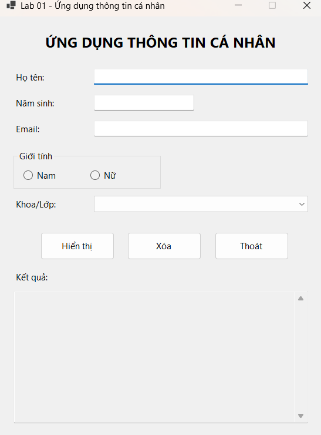
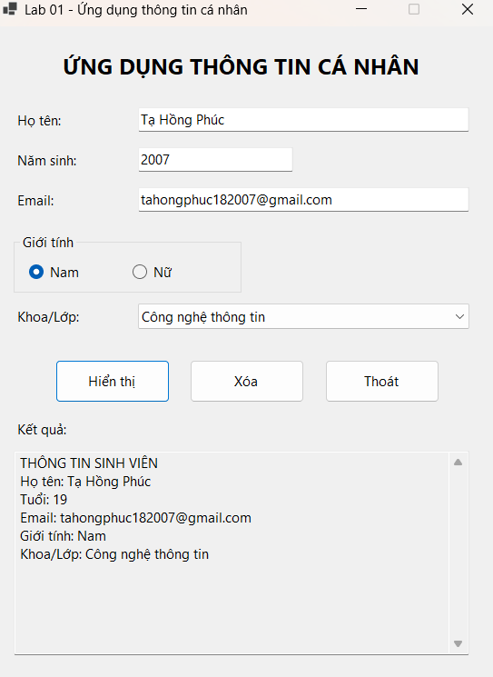
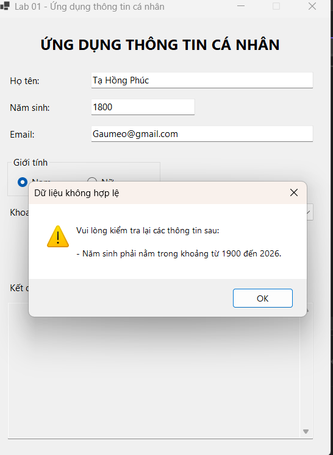
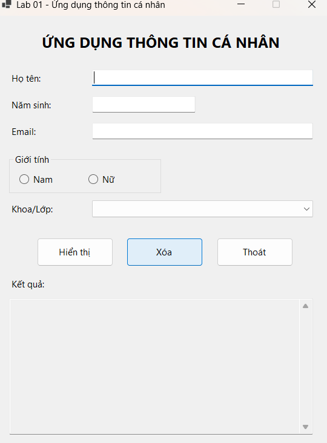
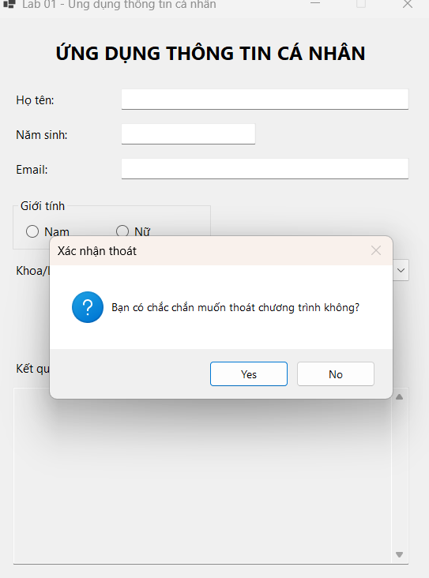

# Lab 01 - Ứng dụng Thông tin cá nhân

**Học phần:** 2611COMP101904 - Lập trình trên Windows
**Sinh viên:** _(Tạ Hồng Phúc)_
**Công nghệ:** C# - Windows Forms App (.NET 8)

## 1. Mô tả

Ứng dụng Windows Forms cho phép nhập thông tin cá nhân của sinh viên (họ tên, năm sinh, email, giới
tính, khoa/lớp), kiểm tra tính hợp lệ của dữ liệu, sau đó hiển thị thông tin tổng hợp khi người dùng
nhấn nút **Hiển thị**.

## 2. Danh sách control

| STT | Control     | Tên               | Chức năng                            |
| --- | ----------- | ----------------- | ------------------------------------ |
| 1   | Label       | `lblTitle`        | Tiêu đề chương trình                 |
| 2   | TextBox     | `txtHoTen`        | Nhập họ tên                          |
| 3   | TextBox     | `txtNamSinh`      | Nhập năm sinh                        |
| 4   | TextBox     | `txtEmail`        | Nhập email                           |
| 5   | RadioButton | `radNam`, `radNu` | Chọn giới tính (trong `grpGioiTinh`) |
| 6   | ComboBox    | `cboKhoa`         | Chọn khoa/lớp                        |
| 7   | Button      | `btnHienThi`      | Kiểm tra và hiển thị thông tin       |
| 8   | Button      | `btnXoa`          | Xóa toàn bộ dữ liệu đã nhập          |
| 9   | Button      | `btnThoat`        | Thoát chương trình (có xác nhận)     |
| 10  | TextBox     | `txtKetQua`       | Hiển thị kết quả tổng hợp            |

## 3. Kiểm tra dữ liệu

- Họ tên không được rỗng.
- Năm sinh không được rỗng, phải là số nguyên, trong khoảng 1900 đến năm hiện tại.
- Email không được rỗng.
- Phải chọn giới tính.
- Phải chọn khoa/lớp.

Nếu có lỗi, chương trình hiển thị `MessageBox` liệt kê tất cả các lỗi cùng lúc.

## 4. Cách chạy chương trình

1. Mở file `Lab01_ThongTinCaNhan.csproj` bằng Visual Studio (yêu cầu .NET 8 SDK + workload
   ".NET Desktop Development").
2. Nhấn **F5** hoặc **Start** để build và chạy.

## 5. Kết quả chạy chương trình

### 5.1. Giao diện ban đầu



Khi mở chương trình, Form hiển thị đầy đủ các control: ô nhập họ tên, năm sinh, email, nhóm
RadioButton chọn giới tính (chưa chọn), ComboBox khoa/lớp (chưa chọn) và 3 nút lệnh Hiển thị/Xóa/Thoát.

### 5.2. Nhập đầy đủ thông tin và nhấn Hiển thị



Với dữ liệu nhập: Họ tên = `Tạ Hồng Phúc`, Năm sinh = `2007`, Email =
`tahongphuc182007@gmail.com`, Giới tính = `Nam`, Khoa = `Công nghệ thông tin`, sau khi nhấn
**Hiển thị**, chương trình kiểm tra hợp lệ và in ra ô kết quả:

```
THÔNG TIN SINH VIÊN
Họ tên: Tạ Hồng Phúc
Tuổi: 19
Email: tahongphuc182007@gmail.com
Giới tính: Nam
Khoa/Lớp: Công nghệ thông tin
```

### 5.3. Thông báo lỗi khi dữ liệu không hợp lệ



Khi nhập năm sinh `1800` (ngoài khoảng cho phép), chương trình không cho hiển thị kết quả mà bật
`MessageBox` cảnh báo: _"Năm sinh phải nằm trong khoảng từ 1900 đến 2026."_ Các lỗi khác (họ tên
rỗng, email rỗng, chưa chọn giới tính, chưa chọn khoa/lớp...) cũng được liệt kê tương tự trong cùng
một hộp thoại nếu xảy ra đồng thời.

### 5.4. Sau khi nhấn nút Xóa



Nhấn **Xóa** sẽ đưa toàn bộ Form về trạng thái ban đầu: các TextBox trống, không RadioButton nào
được chọn, ComboBox khoa/lớp về trạng thái chưa chọn, ô kết quả được xóa và con trỏ quay lại ô
Họ tên.

### 5.5. Xác nhận khi nhấn nút Thoát



Nhấn **Thoát** sẽ hiện hộp thoại xác nhận _"Bạn có chắc chắn muốn thoát chương trình không?"_ với
hai lựa chọn Yes/No; chọn **Yes** chương trình mới đóng lại, chọn **No** thì tiếp tục sử dụng.

## 6. Ví dụ dữ liệu mẫu

Nhập: Họ tên = `Nguyễn Văn A`, Năm sinh = `2005`, Email = `nguyenvana@example.com`, Giới tính = `Nam`,
Khoa = `Công nghệ thông tin`.

Kết quả hiển thị:

```
THÔNG TIN SINH VIÊN
Họ tên: Nguyễn Văn A
Tuổi: 21
Email: nguyenvana@example.com
Giới tính: Nam
Khoa/Lớp: Công nghệ thông tin
```
