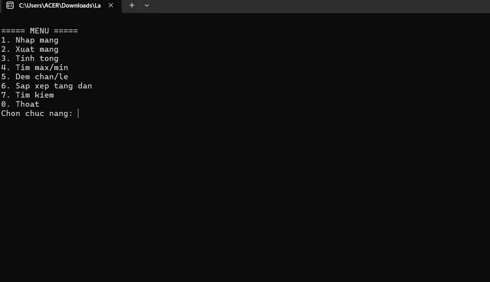
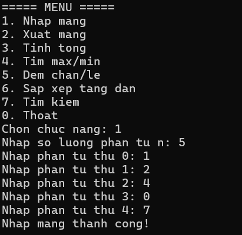
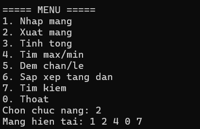
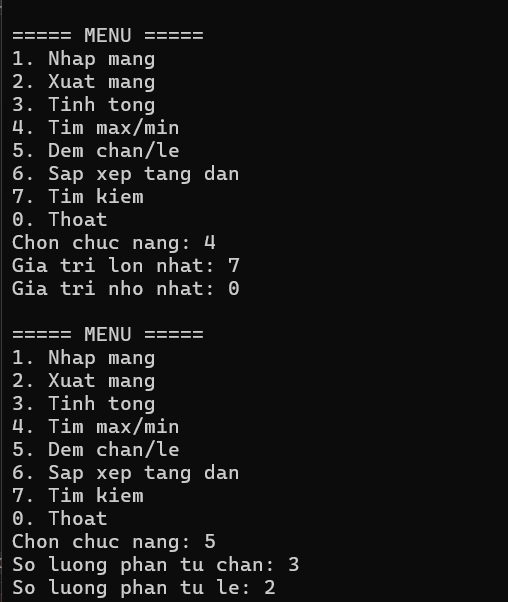
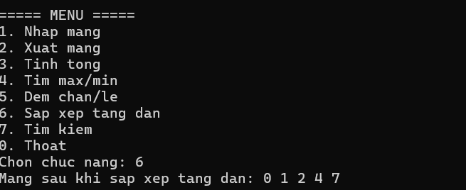
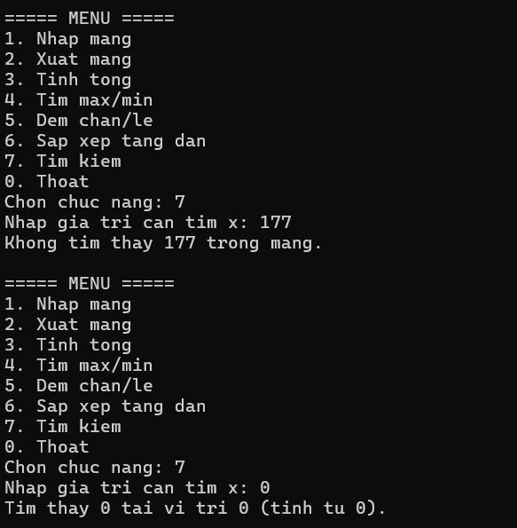
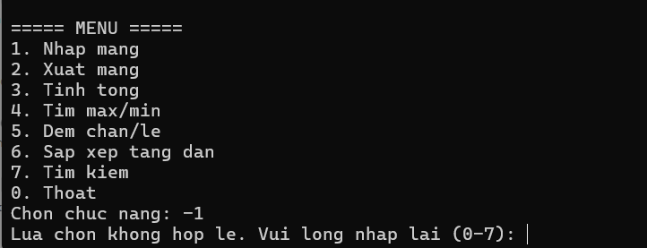

# Lab 02 - Quản lý mảng số nguyên bằng Console

**Học phần:** COMP1019 - Lập trình trên Windows
**Sinh viên:** *(điền tên bạn ở đây)*
**Công nghệ:** C# - Console App (.NET 8)

## 1. Mô tả

Chương trình Console quản lý một mảng số nguyên thông qua menu lựa chọn. Người dùng phải nhập mảng
(chức năng 1) trước khi có thể sử dụng các chức năng xử lý còn lại. Sau mỗi chức năng, chương trình
quay lại menu cho đến khi chọn **0. Thoát**.

## 2. Cấu trúc chương trình

Toàn bộ xử lý được tách thành các phương thức nhỏ trong `Program.cs`, không viết dồn vào `Main`:

| Phương thức | Vai trò |
|---|---|
| `HienThiMenu()` | In menu ra màn hình |
| `NhapLuaChonMenu()` | Đọc và kiểm tra lựa chọn menu (0-7) |
| `XuLyLuaChon(int)` | Điều hướng đến chức năng tương ứng |
| `KiemTraDaNhapMang()` | Chặn các chức năng 2-7 nếu chưa nhập mảng |
| `NhapSoNguyen(string)` | Đọc một số nguyên bất kỳ, lặp lại nếu sai định dạng |
| `NhapSoNguyenDuong(string)` | Đọc một số nguyên dương, dùng cho số lượng phần tử n |
| `NhapMang()` | Nhập n và n phần tử của mảng |
| `XuatMang(int[])` | In toàn bộ phần tử của mảng |
| `TinhTong(int[])` | Tính tổng các phần tử |
| `TimMax(int[])` / `TimMin(int[])` | Tìm giá trị lớn nhất / nhỏ nhất |
| `DemChan(int[])` / `DemLe(int[])` | Đếm số phần tử chẵn / lẻ |
| `SapXepTangDan(int[])` | Sắp xếp mảng tăng dần (Bubble Sort) |
| `TimKiem(int[], int)` | Tìm kiếm tuần tự, trả về vị trí đầu tiên hoặc -1 |

## 3. Kiểm tra dữ liệu nhập

- Số lượng phần tử `n`: phải là số nguyên dương (> 0); nếu nhập chữ, số 0 hoặc số âm, chương trình
  báo lỗi và yêu cầu nhập lại.
- Lựa chọn menu: chỉ chấp nhận số nguyên từ 0 đến 7; nhập sai không làm chương trình dừng bất
  thường mà chỉ yêu cầu nhập lại.
- Các chức năng 2-7 đều kiểm tra đã có mảng hay chưa trước khi thực hiện, nếu chưa sẽ nhắc chọn
  chức năng 1 trước.

## 4. Cách chạy chương trình

1. Mở thư mục project bằng Visual Studio (yêu cầu .NET 8 SDK) hoặc mở file
   `Lab02_QuanLyMang.csproj`.
2. Nhấn **F5**/**Ctrl+F5** để build và chạy, hoặc chạy bằng dòng lệnh:
   ```
   dotnet run
   ```

## 5. Dữ liệu kiểm thử tham khảo

| STT | Dữ liệu nhập | Kết quả mong đợi |
|---|---|---|
| 1 | 5 phần tử: `4 1 9 2 7` | Tổng = 23, max = 9, min = 1, chẵn = 2, lẻ = 3 |
| 2 | 4 phần tử: `-3 0 8 -1` | Tổng = 4, max = 8, min = -3, chẵn = 2, lẻ = 2 |
| 3 | Tìm x = 9 trong `4 1 9 2 7` | Có tìm thấy, vị trí đầu tiên là 2 (tính từ 0) |
| 4 | Tìm x = 5 trong `4 1 9 2 7` | Không tìm thấy |
| 5 | Nhập n = 0 hoặc n âm | Chương trình yêu cầu nhập lại |

## 6. Kết quả chạy chương trình

Dữ liệu dùng để chạy demo: mảng gồm 5 phần tử `1 2 4 0 7`.

### 6.1. Menu chương trình



Menu hiển thị đúng 8 lựa chọn (1-7 và 0. Thoat) theo mẫu đề bài, con trỏ chờ nhập lựa chọn.

### 6.2. Nhập mảng



Chọn chức năng **1**, nhập số lượng phần tử `n = 5`, sau đó nhập lần lượt 5 phần tử: `1 2 4 0 7`.
Chương trình báo *"Nhap mang thanh cong!"*.

### 6.3. Xuất mảng



Chọn chức năng **2**, chương trình in ra mảng hiện tại: `1 2 4 0 7`.

### 6.4. Tìm max/min và đếm chẵn/lẻ



- Chức năng **4**: giá trị lớn nhất = `7`, giá trị nhỏ nhất = `0`.
- Chức năng **5**: số phần tử chẵn = `3` (2, 4, 0), số phần tử lẻ = `2` (1, 7).

### 6.5. Sắp xếp tăng dần



Chọn chức năng **6**, mảng `1 2 4 0 7` được sắp xếp tăng dần thành `0 1 2 4 7`.

### 6.6. Tìm kiếm



Chọn chức năng **7** hai lần:
- Tìm `x = 177`: không tìm thấy trong mảng.
- Tìm `x = 0` (sau khi mảng đã sắp xếp thành `0 1 2 4 7`): tìm thấy tại vị trí `0` (tính từ 0).

### 6.7. Kiểm tra dữ liệu nhập sai



Khi nhập lựa chọn menu `-1` (ngoài khoảng 0-7), chương trình không bị dừng bất thường mà báo
*"Lua chon khong hop le. Vui long nhap lai (0-7)"* và chờ nhập lại.
